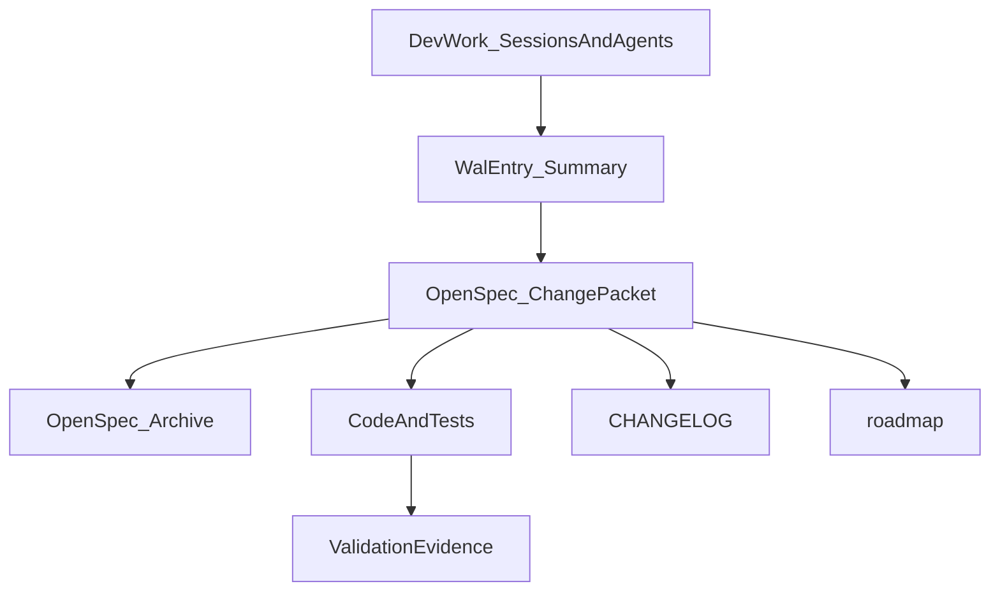

# AI 开发 WAL（Write-Ahead Log）规范草案

> 目的：让不同 session / 不同 agent 可以像数据库“重启恢复”一样，**快速恢复决策链与动作链**，但不引入巨大的体积与噪音。

## 背景类比：DB 的 WAL vs AI 开发的 WAL

传统数据库通常用 WAL 解决两类问题：

- **可恢复性**：崩溃后可重放关键操作，恢复一致状态
- **可审计性**：能回答“发生了什么、为什么这么做”

AI 编程协作里也有类似痛点：

- 换了一个 agent/换了一个人，常常无法从最终代码中快速推断**为什么**要这样设计
- 从头阅读 transcript 体积巨大，噪音多，恢复成本高

因此我们引入“AI 开发 WAL”的中间层：**结构化、可重放、可 checkpoint、可压缩**。

## 设计目标

- **Context Recovery**：新 agent 在 2-5 分钟内建立有效上下文
- **Low Volume**：体积可控（默认不超过 50KB/entry）
- **Traceability**：能追溯到具体 change packet、commit、文件、验证证据
- **Workflow-native**：和本仓库既有的 OpenSpec + closeout loop 贴合

## 核心概念

- **Raw trace（原始迹线）**：完整对话/终端输出等（体积大，不作为默认输入）
- **WAL entry（条目）**：一次“有边界的决策/交付单元”的结构化摘要
- **Checkpoint（检查点）**：一组 WAL entry 冻结后的状态（通常对应归档/发布）

本仓库的默认 WAL 单位：

- **以 OpenSpec change packet 为主**（`openspec/changes/<change-id>/`）
- 重大 incident/决策可额外写成独立 entry（`unit.type=incident/decision`）

## 与仓库现有机制的关系



说明：

- OpenSpec change packet 是“交付包”，WAL entry 是“可检索的恢复索引”
- Archive 表示 checkpoint：变更完成、冻结、便于以后检索

## 文件结构规范（.codex/wal）

```
.codex/wal/
  README.md
  schema/
    wal-entry.schema.json
  entries/
    YYYY/
      YYYY-MM-DD_<change-id>.json
  index/
    index.json
    by-change.json
    by-file.json
    by-topic.json
```

命名约定：

- `YYYY-MM-DD_<change-id>.json`：与 `openspec/changes/<change-id>/` 同名，便于关联

## WAL Entry 字段规范（摘要）

必填（核心）：

- **id**：稳定 ID（建议同文件名）
- **unit**：本条 entry 的边界（默认 openspec-change + changeId + milestone + status）
- **intent**：summary / whyNow / nonGoals（回答“为什么”）
- **decisions**：重要决策（选项、决策、理由、风险）
- **actions**：filesTouched / commandsRun / testsRun（回答“做了什么”）
- **evidence**：validationStatus + notes（回答“凭什么相信它对”）
- **links**：changePaths / commitShas / changelogPaths / roadmapPaths

可选（建议）：

- **topics**：检索关键词（sqlite、ui、export、stability…）
- **followUps**：后续改进点（不属于本次交付的延伸）

## 体积控制与压缩策略

强约束：

- 单条 entry **建议 ≤ 50KB**
- 不嵌入大体积内容（大表格、完整 diff、长 transcript）

推荐做法：

- 只记录：**命令、文件路径、关键决策摘要、风险点**
- 需要细节时，用 links 指向：
  - OpenSpec docs（design/tasks/spec）
  - commit SHA / PR（如果有）

Checkpoint 机制（压缩）：

- 当一个 change 被归档到 `openspec/changes/archive/...`，对应 WAL entry 视为“冻结”；后续只追加新 entry，而不是在旧 entry 里无限增长。

## 示例：如何读/写 WAL

### 读 WAL（新 agent 快速恢复）

建议顺序：

1. 读 `.codex/wal/index/by-change.json`（或直接找 entry 文件）
2. 打开 `entries/YYYY/YYYY-MM-DD_<change-id>.json`：先读 intent/decisions/evidence
3. 跳转到 `openspec/changes/...`：核对 design/tasks/closeout
4. 必要时再看具体代码文件或 commit

### 写 WAL（完成一个 milestone 后）

最小更新清单：

- intent 是否变化（scope 变了必须改）
- decisions 是否新增（例如锁策略、schema key、UI 分区）
- actions：记录 filesTouched + commands/tests
- evidence：明确 pass/fail 与残余风险
- links：指向 change packet 与 changelog/roadmap（如果更新了）

## 适用边界与反例

WAL 不适合：

- 记录每一句 prompt/回复（体积膨胀、噪音大）
- 记录完整 diff（应交给 git）
- 记录大规模数据样本（应存到 test fixtures 或独立文件）

WAL 适合：

- 解释“为什么这样设计”
- 明确“做了什么、跑了什么、结果如何”
- 为未来 agent 提供“入口索引”

